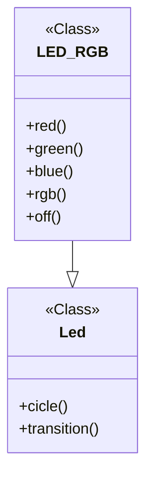
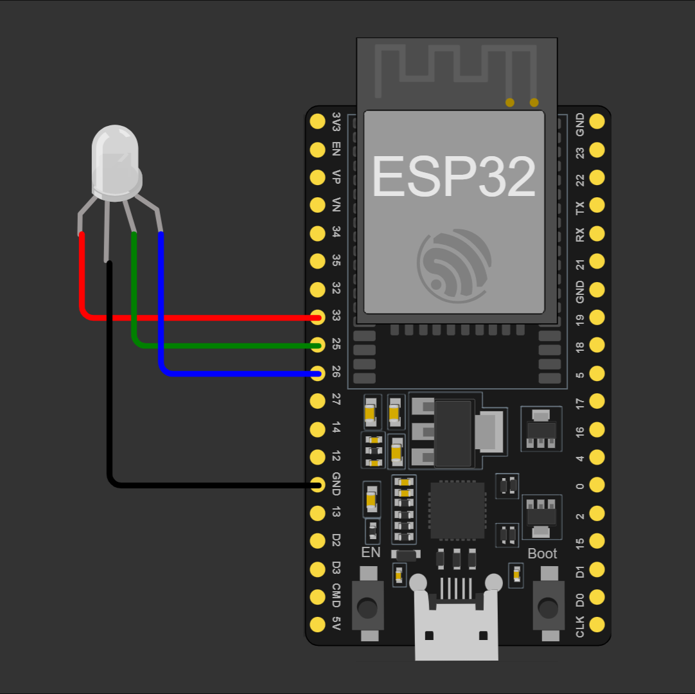
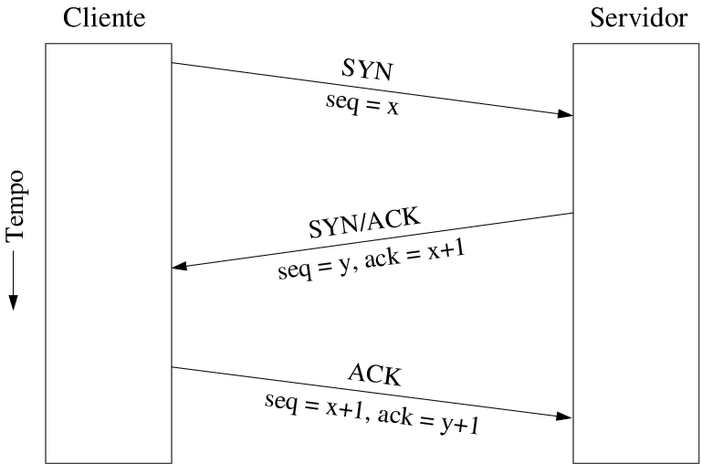
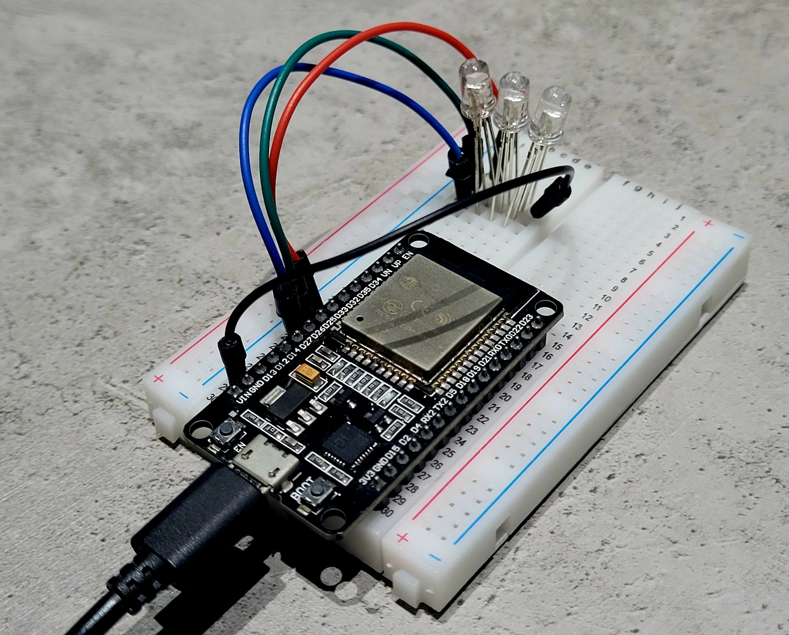
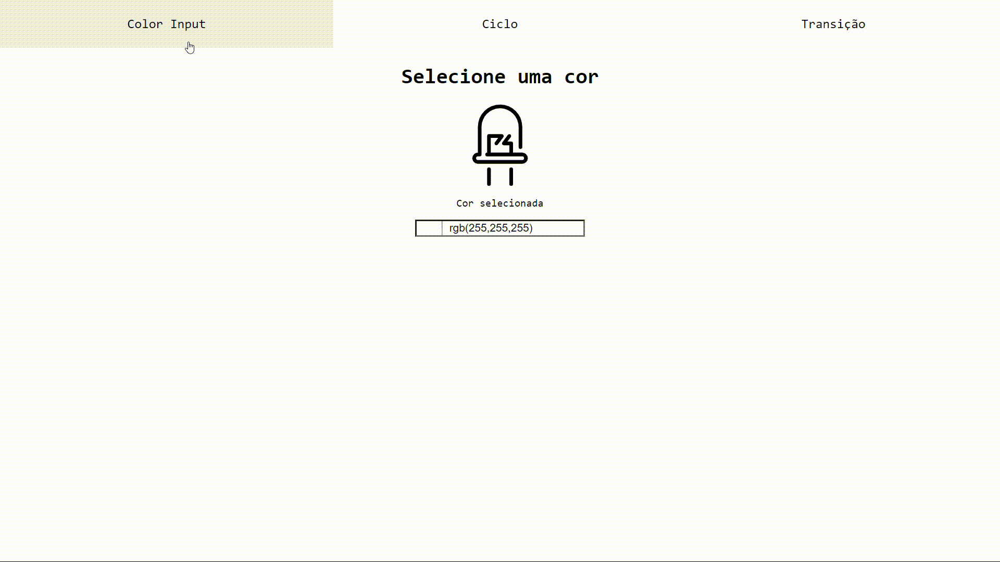

<h1 align="center">Web Server em Micropython</h1>
<p align="center"><i>Repositório para documentação do projeto desenvolvido para obtenção de nota P2 na disciplina Introdução a Programação de Computadores (IPC).</i></p>

##  Informações do autor
**Nome:** Célio Lima Benjamim

**Matrícula:** 2415080041

**Curso:** Eng. Computação - UEA/EST

## 1. Introdução
O projeto tem como intuto utilizar a linguagem de programação Python para desenvolver um servidor WEB hospedado numa ESP32 para cotrole de LEDs RGB por meio de pulso de modularização (PWM).

Os pontos mais importantes do desenvolvimento e os principais conceitos serão apresentados neste documento.

### 1.1. Tecnologias Utilizadas

 

**Micropython:** é uma implementação leve e eficiente da linguagem de programção Python3, que inclui um pequeno subconjunto das bibliotecas padrões do Python. É otimizada para ser executada em microcontroladores, como a ESP32 ou RaspberryPi. Ele é compacto o suficiente para caber e rodar em apenas 256 kB de memória e 16 kB de RAM [1](https://micropython.org/#:~:text=MicroPython%20is%20a%20lean%20and%20efficient%20implementation%20of%20the%20Python%203%20programming%20language%20that%20includes%20a%20small%20subset%20of%20the%20Python%20standard%20library%20and%20is%20optimised%20to%20run%20on%20microcontrollers%20and%20in%20constrained%20environments.). Utilizada em todo o projeto, tem como base principal o Python.


**Python:** Python é uma linguagem de programação que permite que você trabalhe rapidamente e integre sistemas de forma mais eficaz [2](https://www.python.org/#:~:text=Python%20%C3%A9%20uma%20linguagem%20de%20programa%C3%A7%C3%A3o%20que%20permite%20que%20voc%C3%AA%20trabalhe%20rapidamente%20e%20integre%20sistemas%20de%20forma%20mais%20eficaz.). Lingaguem de programação vista em sala de aula.


**JavaScript:** 
JavaScript é uma linguagem de programação de alto nível e interpretada, usada principalmente para criar e controlar conteúdo dinâmico em páginas web, permitindo interatividade, animações e comunicação com o back-end [3](https://developer.mozilla.org/en-US/docs/Web/JavaScript#:~:text=JavaScript-,JavaScript%20(JS),-is%20a%20lightweight). Linaguem utilizada para fazer comunicação entre Front-end e Back-end (cliente e servidor).


**ESP32:** ESP32 é um chip que fornece Wi-Fi e Bluetooth para dispositivos embarcados – isto é, um dispositivo ideal para IoT (Internet das Coisas) [4](https://www.nabto.com/guide-to-iot-esp-32/#:~:text=ESP32%20%C3%A9%20um%20chip%20que%20fornece%20Wi%2DFi%20e%20(em%20alguns%20modelos)%20conectividade%20Bluetooth%20para%20dispositivos%20embarcados%20%E2%80%93%20em%20outras%20palavras%2C%20para%20dispositivos%20IoT.).

**Informações técnicas (ESP32):** [5](https://www.saravati.com.br/placa-esp32-wifi-bluetooth-devkit-v1-30-pinos.html#:~:text=ESP32%20ESP%2DWROOM%2D32%20DEVKit,Conex%C3%A3o%20Wifi%202.4Ghz)

* ESP32 ESP-WROOM-32 DEVKit V1
* CPU: Xtensa® Dual-Core 32-bit LX6
* ROM: 448 KBytes
* RAM: 520 Kbytes
* Flash: 4 MB
* Clock: 80 à 240MHz (Ajustável)
* WiFi 802.11 b/g/n: 2.4 à 2.5 GHz
* Bluetooth BLE 4.2 BR/EDR e BLE (Bluetooth Low Energy)
* Conexão Wifi 2.4Ghz

                                                                                                  
### 1.2. Ferramentas de desenvolvimento


**VS Code:** O Visual Studio Code (VS Code) é um editor de código de código aberto desenvolvido pela Microsoft. É apenas um Editor de Código, o qual possui as funcionalidades mais simples como: [6](https://www.treinaweb.com.br/blog/vs-code-o-que-e-e-por-que-voce-deve-usar#:~:text=O%20Visual%20Studio%20Code%20(VS%20Code)%20%C3%A9%20um%20editor%20de%20c%C3%B3digo%20de%20c%C3%B3digo%20aberto%20desenvolvido%20pela%20Microsoft.)

* edição de código com suporte a várias linguagens de programação;
* terminal de comandos integrado;
* controle de versão;


**Thonny:** é uma IDE de Python que permite que se programe as placas ESP32 e ESP8266 com MicroPython. [7](https://randomnerdtutorials.com/getting-started-thonny-micropython-python-ide-esp32-esp8266/)

## 2. Justificativa e objetivos

### 2.1. Por onde começar? Por que MicroPython?
Primeiro, é importante destacar que, nativamente, a maioria dos microcontroladores utilizam linguagem de baixo nível, como C ou C++, por exemplo. Então o primeiro passo a se fazer é a instalação do firmware do MicroPython na ESP32 através do Thonny IDE, pois, apenas assim, o microcontrolador saberá o que fazer com o código Python.

A maior vantagem de se utilzar MicroPython é porque Python é uma linguagem de alto nível, isto é, é mais próximo da linaguem natural, falada por seres humanos. Então desenvolver com ela é muito mais fácil, prático e eficiente do que em C++. Suas desvantagens são apenas o tempo de execução que às vezes pode ser muito alto, e consumo de processamento não muito eficiente.

### 2.2. A ideia do projeto
A ideia principal do projeto, como já falado anteriormente, é fazer um servidor WEB para controlar LEDs RGB com a ESP32 via pulso de modularização (PWM). Mas antes, vamos por partes:

#### **WEB Server**


<div style="text-align: center;">
    
</div>

Um servidor web é um componente de software que processa solicitações de clientes (*clients*) e entrega conteúdos, como páginas HTML, imagens, vídeos e outros recursos via protocolos HTTP/HTTPS. Ele opera sobre a pilha de protocolos TCP/IP, onde:

* TCP (Transmission Control Protocol): Garante a entrega confiável dos pacotes de dados entre o cliente e o servidor, estabelecendo uma conexão persistente e ordenada.

* IP (Internet Protocol): Lida com o endereçamento e encaminhamento dos pacotes de dados pela rede, garantindo que eles cheguem ao destino correto.

Quando um usuário digita uma URL no navegador, o navegador envia uma solicitação HTTP ao servidor web. O servidor web então processa essa solicitação, acessa os recursos solicitados (como arquivos HTML) e envia uma resposta HTTP de volta ao navegador, que exibe o conteúdo ao usuário.

#### **LED RGB**

<p style="text-align: center;">
    
    
</p>

Não há muito mistério, é apenas um LED RGB. Foi escolhido arbitrariamente apenas para mostrar que o projeto tem uma aplicabilidade maior, mas poderia ser aplicado, por exemplo, com qualquer atuador, sensores, motores, relés, ou qualquer outra coisa que se aplique à eletrônica. Especificamente neste projeto, utiliza-se apenas LEDs de Alto Brilho do tipo anodo comum (figura à esquerda).

#### **ESP32 e PWM**
<div style="text-align: center;">
    
</div>

PWM (Pulse Width Modulation), ou Modulação por Largura de Pulso, é um conceito de eletrônica digital, mas resumidamente: é uma técnica que envolve a variação da largura dos pulsos em um sinal elétrico. Em outras palavras, o PWM pulsa rapidamente um sinal digital em um condutor, transmitindo uma informação pela variação da largura de uma onda. Ela permite controlar a intensidade de sinais analógicos, como a luminosidade de LEDs ou a velocidade de motores, variando a largura dos pulsos de um sinal digital.

Na ESP32, todos os pinos de entrada e saída (GPIOs) são controláveis por PWM. Algumas informações relevantes:
* Duty Cycle: A razão entre o tempo em que o sinal está em nível alto (ligado) e o período total do sinal.

* Frequência: A taxa na qual o PWM oscila entre ligado e desligado.

* Resolução: O número de bits utilizado para definir o duty cycle. A ESP32 tem uma resolução máxima de 10 bits, isto é: $2^{10} = 1024$, assim, sua resolução varia de 0 até 1023.

Tendo isto em mente, podemos seguir para o desenvolvimento do projeto em si.

## 3. Desenvolvimento

Neste repositório, os arquivos que serão citados a seguir pode ser encontrados na pasta [`src`](./src/).

Primeiro, o MicroPython tem um fluxo que executa os arquivos, primeiro com o [`boot.py`](./src/boot.py) e posteriormente o [`main.py`](./src/main.py), apenas. Todo código a ser executado devem estar relacionados a esses dois arquivos.

### 3.1. *boot.py*

```Python
# boot.py

from machine import Pin
import network

# Configurações iniciais do WIFI
ssid = 'ssid'
password = '12345678'

# Conectando no WIFI
station = network.WLAN(network.STA_IF) # Station Interface
station.active(True)
station.connect(ssid, password)

while not station.isconnected():
    pass

# Conectado!
print('Conectado com sucesso!', station.ifconfig())
led = Pin(2, Pin.OUT)
led.on()

```

O arquivo `boot.py` é sempre executado quando a ESP é (re)iniciada, então é ideal para configurações iniciais, como declarações de pinos (GPIOs) e configurações de conexões. 

O módulo `machine` contém funções específicas para controle do hardware da placa de desenvolvimento. Uma delas é a classe `Pin`, que define um objeto usado para controlar pinos de I/O (In/Out), no caso, as GPIOs da ESP. Objetos pin são comumente associados a um pino físico que pode acionar uma tensão de saída e ler tensões de entrada. 

O módulo `network` é usada para fazer a configuração de conexão Wi-Fi. Há duas interfaces WiFi, uma para a *station* (quando o ESP se conecta a um roteador) e uma para o ponto de acesso (para outros dispositivos se conectarem ao ESP). O que se quer no projeto é que a ESP tenha acesso à internet, por isso é utilizado o `network.WLAN(network.STA_IF)`.

### 3.2. *main.py*
Como o próprio nome já diz, é o código principal que está rodando. Como ele é um pouco grande, vamos dividir por partes.

```Python
# main.py

import socket
import ujson
from Led import Led
from html import html
```

Os módulos `socket` e `ujson` são próprios do Python e serão explicados posteriormente. No entando, as classes `Led` e `html` foram desenvolvidos especificamente para facilitar o entendimento, funcionamento e manutenção deste projeto.

#### *Led.py*

``` Python
# Led.py

from LED_RGB import LED_RGB as led
from time import sleep_ms
```

O módulo `time` também é próprio do Python e serve para controlar o fluxo de tempo do programa, neste caso é utilizado apenas para pequenas pausas no código devido a certos fluxos de trabalho. E, novamente, a classe `LED_RGB` foi desenvolvida para facilitar o código.

Antes de explicar as classes, é importante que se conheça o que é POO (Programação Orientada a Objetos).

### 3.3. Orientação a objetos em Python
Orientação a objetos é um paradigma aplicado na programação que consiste na interação entre diversas unidades chamadas de objetos [8](https://balta.io/blog/orientacao-a-objetos#:~:text=Orienta%C3%A7%C3%A3o%20a%20objetos%20%C3%A9%20um%20paradigma%20aplicado%20na%20programa%C3%A7%C3%A3o%20que%20consiste%20na%20intera%C3%A7%C3%A3o%20entre%20diversas%20unidades%20chamadas%20de%20objetos.). Ela é definida por quatro pilares principais, sendo eles herança, encapsulamento, abstração e polimorfismo. Mas vamos discutir apenas sobre herança e abstração.

#### **Herança**
O conceito de herdar é ser uma cópia de outra classe com algumas características adicionais. Assim é possível acessar métodos e atributos da classe pai ao herdar essas características. É o que foi feito com as classes `LED_RGB` (pai) e `Led` (filho), conforme pode ser visto no diagrama UML abaixo.



#### **Abstração**
A abstração em POO é a capacidade de ocultar detalhes irrelevantes ou complexos de um problema e focar nos aspectos essenciais. Ela é implementada por meio de classes, que são modelos que descrevem os atributos e comportamentos comuns de um grupo de objetos [9](https://www.dio.me/articles/pilares-de-poo-em-java#:~:text=A%20abstra%C3%A7%C3%A3o%20na%20POO%20%C3%A9%20a%20capacidade%20de%20ocultar%20detalhes%20irrelevantes%20ou%20complexos%20de%20um%20problema%20e%20focar%20nos%20aspectos%20essenciais.%20Ela%20%C3%A9%20implementada%20por%20meio%20de%20classes%2C%20que%20s%C3%A3o%20modelos%20que%20descrevem%20os%20atributos%20e%20comportamentos%20comuns%20de%20um%20grupo%20de%20objetos). Que é exatamente o que estamos fazendo com a classe LED_RGB. Ao invés de ficar sempre manipulando as GPIOs diretamente, abstraimos ela para o método `rgb()`.

Sabendo esses conceitos básicos, agora é possível voltar ao código.

### 3.4. Voltando ao código
#### *LED_RGB.py*
``` Python
# LED_RGB.py

from machine import Pin, PWM

class LED_RGB:
    def __init__(self, 
                 r_pin: int, 
                 g_pin: int, 
                 b_pin: int, 
                 freq: int = 60
                 ) -> None:
        self.PWM_r = PWM(Pin(r_pin))
        self.PWM_g = PWM(Pin(g_pin))
        self.PWM_b = PWM(Pin(b_pin))
        
        self.PWM_r.freq(freq)
        self.PWM_g.freq(freq)
        self.PWM_b.freq(freq)
    
    
    def rgb(self, 
            r: int, 
            g: int, 
            b: int
            ) -> None:
        print(f"r: {r}, g: {g}, b: {b}\n")
        self.red(r)
        self.green(g)
        self.blue(b)
        
        
    def red(self, 
            duty: int) -> None:
        self.PWM_r.duty(duty)
    
    
    def green(self, 
              duty: int) -> None:
        self.PWM_g.duty(duty)
    
    
    def blue(self,
             duty: int) -> None:
        self.PWM_b.duty(duty)
        
        
    def off(self) -> None:
        self.rgb(0, 0, 0)
```
Nesta classe, é apenas abstraído a ideia de PWM nos respectivos pinos dos leds vermelho, verde e azul, que são definidos quando instaciamos o objeto `Led` (que herda de `RGB_LED`).

#### *Led.py*
```Python
# Led.py

from LED_RGB import LED_RGB as led
from time import sleep_ms

# Herdando a classe LED_RGB para a classe Led
class Led(led):
    def cicle(self, 
              preset: int = 1,
              delay: int = 50, 
              loop: int = 1,
              hex_list: list[str] = []
              ) -> None:
        
        if preset == 1:
            delay = 250
            loop = 2
            hex_list = [ 
                "#000000", # black (off)
                "#0000FF", # blue
                "#00FF00", # green
                "#00FFFF", # green + blue = cyan
                "#FF0000", # red
                "#FF00FF", # red + blue = purple
                "#FFFF00", # red + green = yellow
                "#FFFFFF", # red + green + blue = white (on)
            ]
            
        elif preset == 2:
            delay = 100
            loop = 4
            hex_list = [
                "#0000FF", # blue
                "#00FF00", # green
                "#00FFFF", # green + blue = cyan
                "#00FF00", # green
                "#0000FF", # blue
            ]
        
        elif preset == 3:
            delay = 250
            loop = 5
            hex_list = [ 
                "#0000FF", # blue
                "#FF0000", # red
            ]
            
        for _ in range(loop):
            for h in hex_list:
                h = list(h)

                r = int(h[1] + h[2], 16)*4
                g = int(h[3] + h[4], 16)*4
                b = int(h[5] + h[6], 16)*4
                
                led.rgb(self, r, g, b)
                sleep_ms(delay)
    
    def transition(self, 
                   delay: int, 
                   step: int = 64
                   ) -> None:
        
        # Estado inicial de r, g e b (definido arbitrariamente)
        r, g, b = 1023, 0, 0

        led.rgb(self, r, g, b)

        # r = 1023, g aumenta de 0 para 1023, b = 0
        while g < 1023:
            g += step
            g = 1023 if g > 1023 else g

            led.rgb(self, r, g, b)        
            sleep_ms(delay)

            if g > 1023: break


        # r diminui de 1023 para 0, g = 1023, b = 0
        while r > 0:
            r -= step
            r = 0 if r < 0 else r

            led.rgb(self, r, g, b)
            sleep_ms(delay)

            if r < 0: break


        # g = 1023, b aumenta de 0 para 1023, r = 0
        while b < 1023:
            b += step
            b = 1023 if b > 1023 else b

            led.rgb(self, r, g, b)
            sleep_ms(delay)

            if b > 1023: break


        # g diminui de 1023 para 0, b = 1023, r = 0
        while g > 0:
            g -= step
            g = 0 if g < 0 else g

            led.rgb(self, r, g, b)
            sleep_ms(delay)

            if g < 0: break


        # r aumenta de 0 para 1023, g = 0, b = 1023
        while r < 1023:
            r += step
            r = 1023 if r > 1023 else r

            led.rgb(self, r, g, b)
            sleep_ms(delay)

            if r > 1023: break


        # b diminui de 1023 para 0, r = 1023, g = 0
        while b > 255:
            b -= step
            b = 255 if b < 255 else b

            led.rgb(self, r, g, b)
            sleep_ms(delay)
            
            if b < 255: break
```
Esta classe apenas adiciona mais dois outros métodos em relação à `LED_RGB`, esses métodos são relacionados à regra de negócio escolhida. 

O método `cicle()` define um ciclo definido, que é controlado pelo `hex_list`, que é uma lista que contém os códigos, em hexadecimal, das cores que o usuário quer que o led fique em cada iteração.

O método `transition()` varia entre diversas cores de uma maneira muito mais suave, mas sem muita liberdade de qual cor exatamente se quer em cada iteração.

### 3.5. De volta ao *main.py* 
```Python
# main.py continuação pt. 2

# Instancia o objeto led
led = Led(33, 25, 26)
led.off()
r, g, b = (0, 0, 0)
```
Nesta parte do `main.py` é instanciado o objeto que abstrai os pinos do led, no caso, os pinos que controlam a cor vermelho, verde e azul são as GPIOs 33, 25 e 26, respectivamente, como é possível ver no esquemático do circuito abaixo.



---

```Python
# main.py continuação pt. 3

# Inicia o servidor WEB - TCP/IP Protocol (IPv4)
s = socket.socket(socket.AF_INET, socket.SOCK_STREAM)
s.bind(('', 80))
s.listen(5)
print('Aguardando conexões...')

# Página HTML no arquivo html.py
html = html.page()
```
Aqui é utilizado o *module* `socket`, é, conforme a própria documentação do Python: "A Low-level networking interface [...]  somewhat higher-level than in the C interface" [10](https://docs.python.org/3/library/socket.html#module-socket:~:text=%7C-,socket%20%E2%80%94%20Low%2Dlevel%20networking%20interface,-%C2%B6). Ou seja, mesmo sendo de "baixo nível", ela ainda é mais legível que sua correspondete em C. 

Esse módulo serve basicamente para abrir uma porta na rede (porta 80), esperar um cliente se conectar e aceitar a conexão. Ao utilizar o protocolo TCP/IP, como no caso, há maior fidelidade nos dados que estão sendo encaminhados de cliente para servidor, e vice-versa, embora mais lento.

Logo abaixo `html = html.page()` está apenas armazenando a *string* do site html - esta que, por sua vez, retorna do método `page()`, dentro da classe `html`. Isso é necessário pois quando o cliente solicitar resposta, o socket deve enviar a página html como resposta, no caso, a string html.

---

```Python
# main.py continuação pt. 4

# dentro do loop while True:

conn, address = s.accept() # Handshake
print('Cliente conectado de', address)

request = str(conn.recv(2**10))
```
Nesta parte de loop indefinito, é feito a conexão com o cliente com o comando `s.accept()`, lembrando que `s` é um objeto do tipo socket, ou seja, está "armazenando" o servidor.

`conn` é um novo objeto socket usado para enviar e receber dados da conexão servidor-cliente. `address` é o endereço (IPv4) de quem se conectou (cliente).

`request` está recebendo a string de até $2^{10} = 1024$ bits de dados que o cliente está mandando.

---

```Python
# main.py continuação pt. 5

# dentro do loop while True:

if 'GET / ' in request:
    conn.send('HTTP/1.1 200 OK\r\nContent-Type: text/html\r\n\r\n')
    conn.send(html)
    
elif 'POST /result' in request:
    body = str("{"+request.split('{')[-1]).split('\'')[0]
    data = ujson.loads(body) # Cria um dicionário JSON
    type = data['type'] # Qual dos dados foi enviado (update_color, cicle, transition)
        

    if type == 'update_color':
        r = int(data['r']) * 4
        g = int(data['g']) * 4
        b = int(data['b']) * 4
        led.rgb(r, g, b)
    
    elif type == 'cicle':
        preset = int(data['preset'])
        if preset in {1, 2, 3}: 
            led.cicle(preset)
            led.off()
            continue
        delay = int(data['delay'])
        loop = 1
        hex_list = data['hex_list'].split(chr(0x5C)+'n')
        led.cicle(preset, delay, loop, hex_list)
        led.off()
        
    
    elif type == 'transition':
        delay = int(data['delay'])
        led.transition(delay)
        led.off()
        
    
    conn.send('HTTP/1.1 200 OK\r\nContent-Type: application/json\r\n\r\n')
    conn.send(ujson.dumps({'status': 'success'}))

conn.close()
```

Se `'GET / ' in request:` for verdadeiro, isso demostra que o cliente está pedindo uma resposta afirmativa que ele conseguiu se conectar, e para isso o servidor precisa enviar dados, no caso, a própria página html.

Senão, se `'POST /result' in request`, quer dizer que o cliente enviou algum dado. `body` vai procurar o corpo principal desses dados e armazena em `data`. Todos os dados que podem ser enviados pelo usuário tem o atributo `type`, para que seja possível identificar qual fluxo de trabalho será executado.

Daí, dependendo do valor do `type`, ele executa alguma das regras de negócio definidas.

Ao final desse fluxo verdade de `elif 'POST /result' in request`, o servidor manda ao cliente que essa interação foi bem sucedida e manda `conn.send(ujson.dumps({'status': 'success'}))`. Após isso, o socket é fechado com `conn.close()`, para poder aguardar uma nova conexão, retornando para o começo do loop infinito do `while True`.

### 3.6. Por que tantas confirmações?
Como falado anteriormente, o protocolo escolhido, TCP, é de extrema confiabilidade, sendo assim necessárias diversas confirmações para uma conexão. Isso garante que nenhum dado seja perdido entre as comunicações. O diagrama abaixo representa bem essa situação.



## 4. Resultados e Conclusão
### 4.1. Resultados
Como principais resultados, nota-se:

1. **Montagem do circuito eletrônico**



3. **Finalização do site**



3. **Funcionamento completo do projeto**

Color Input:
[](./images/doc/liga_led.mp4)

Ciclo:
[](./images/doc/ciclo.mp4)

Transição:
[](./images/doc/transicao.mp4)

### 4.2. Conclusão
Este projeto pôde mostrar que é sim possível entrar no mundo de sistemas embarcados sem precisar estudar uma linguagem de programação de baixo nível, como C. 

A acessibilidade que a linguagem Python proporciona e seu grande poder é o que, sem dúvidas, faz com que ela seja hoje uma das linguagens de programação mais utilizada em praticamente todas as áreas.

## 5. Referências

[MicroPython - Official Documentation](https://docs.micropython.org/)

[Python - Official Documentation](https://www.docs.python.org/)

[ESP32 for IoT: A Complete Guide](https://www.nabto.com/guide-to-iot-esp-32/)

[Getting Started with Thonny MicroPython IDE](https://randomnerdtutorials.com/getting-started-thonny-micropython-python-ide-esp32-esp8266/)
