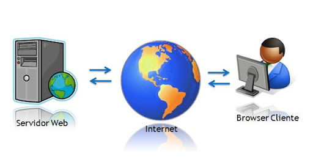
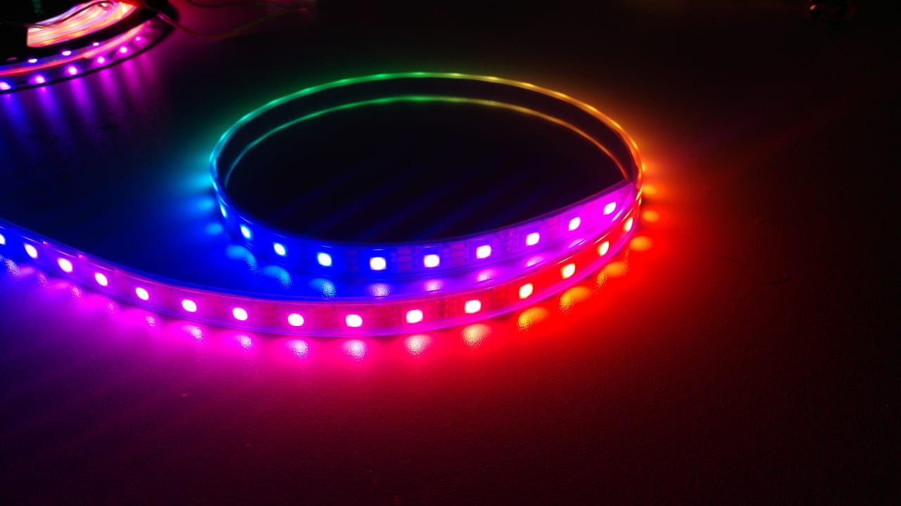
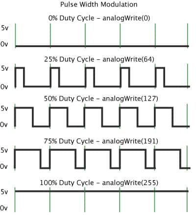
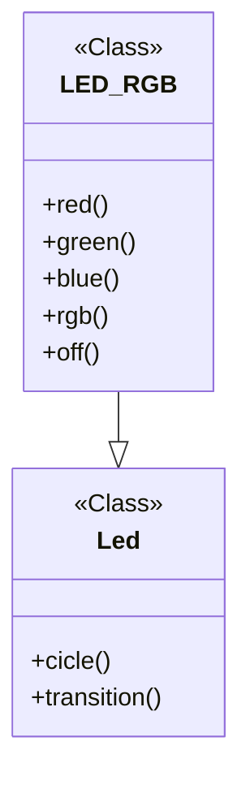

<h1 align="center">Web Server em Micropython</h1>
<p align="center"><i>Repositório para documentação do projeto desenvolvido para obtenção de nota P2 na disciplina Introdução a Programação de Computadores (IPC).</i></p>

##  Informações do autor
**Nome:** Célio Lima Benjamim

**Matrícula:** 2415080041

**Curso:** Eng. Computação - UEA/EST

## 1. Introdução
O projeto tem como intuto utilizar a linguagem de programação Python para desenvolver um servidor WEB hospedado numa ESP32 para cotrole de LEDs RGB por meio de pulso de modularização (PWM).

Os pontos mais importantes do desenvolvimento e os principais conceitos serão apresentados neste documento.

### 1.1. Tecnologias Utilizadas

 

**Micropython:** é uma implementação leve e eficiente da linguagem de programção Python3, que inclui um pequeno subconjunto das bibliotecas padrões do Python. É otimizada para ser executada em microcontroladores, como a ESP32 ou RaspberryPi. Ele é compacto o suficiente para caber e rodar em apenas 256 kB de memória e 16 kB de RAM [1](https://micropython.org/#:~:text=MicroPython%20is%20a%20lean%20and%20efficient%20implementation%20of%20the%20Python%203%20programming%20language%20that%20includes%20a%20small%20subset%20of%20the%20Python%20standard%20library%20and%20is%20optimised%20to%20run%20on%20microcontrollers%20and%20in%20constrained%20environments.). Utilizada em todo o projeto, tem como base principal o Python.


**Python:** Python é uma linguagem de programação que permite que você trabalhe rapidamente e integre sistemas de forma mais eficaz [2](https://www.python.org/#:~:text=Python%20%C3%A9%20uma%20linguagem%20de%20programa%C3%A7%C3%A3o%20que%20permite%20que%20voc%C3%AA%20trabalhe%20rapidamente%20e%20integre%20sistemas%20de%20forma%20mais%20eficaz.). Lingaguem de programação vista em sala de aula.


**JavaScript:** 
JavaScript é uma linguagem de programação de alto nível e interpretada, usada principalmente para criar e controlar conteúdo dinâmico em páginas web, permitindo interatividade, animações e comunicação com o back-end [3](https://developer.mozilla.org/en-US/docs/Web/JavaScript#:~:text=JavaScript-,JavaScript%20(JS),-is%20a%20lightweight). Linaguem utilizada para fazer comunicação entre Front-end e Back-end (cliente e servidor).


**ESP32:** ESP32 é um chip que fornece Wi-Fi e Bluetooth para dispositivos embarcados – isto é, um dispositivo ideal para IoT (Internet das Coisas) [4](https://www.nabto.com/guide-to-iot-esp-32/#:~:text=ESP32%20%C3%A9%20um%20chip%20que%20fornece%20Wi%2DFi%20e%20(em%20alguns%20modelos)%20conectividade%20Bluetooth%20para%20dispositivos%20embarcados%20%E2%80%93%20em%20outras%20palavras%2C%20para%20dispositivos%20IoT.).

**Informações técnicas (ESP32):** [5](https://www.saravati.com.br/placa-esp32-wifi-bluetooth-devkit-v1-30-pinos.html#:~:text=ESP32%20ESP%2DWROOM%2D32%20DEVKit,Conex%C3%A3o%20Wifi%202.4Ghz)

* ESP32 ESP-WROOM-32 DEVKit V1
* CPU: Xtensa® Dual-Core 32-bit LX6
* ROM: 448 KBytes
* RAM: 520 Kbytes
* Flash: 4 MB
* Clock: 80 à 240MHz (Ajustável)
* WiFi 802.11 b/g/n: 2.4 à 2.5 GHz
* Bluetooth BLE 4.2 BR/EDR e BLE (Bluetooth Low Energy)
* Conexão Wifi 2.4Ghz

                                                                                                  
### 1.2. Ferramentas de desenvolvimento


**VS Code:** O Visual Studio Code (VS Code) é um editor de código de código aberto desenvolvido pela Microsoft. É apenas um Editor de Código, o qual possui as funcionalidades mais simples como: [6](https://www.treinaweb.com.br/blog/vs-code-o-que-e-e-por-que-voce-deve-usar#:~:text=O%20Visual%20Studio%20Code%20(VS%20Code)%20%C3%A9%20um%20editor%20de%20c%C3%B3digo%20de%20c%C3%B3digo%20aberto%20desenvolvido%20pela%20Microsoft.)

* edição de código com suporte a várias linguagens de programação;
* terminal de comandos integrado;
* controle de versão;


**Thonny:** é uma IDE de Python que permite que se programe as placas ESP32 e ESP8266 com MicroPython. [7](https://randomnerdtutorials.com/getting-started-thonny-micropython-python-ide-esp32-esp8266/)

## 2. Justificativa e objetivos

### 2.1. Por onde começar? Por que MicroPython?
Primeiro, é importante destacar que, nativamente, a maioria dos microcontroladores utilizam linguagem de baixo nível, como C ou C++, por exemplo. Então o primeiro passo a se fazer é a instalação do firmware do MicroPython na ESP32 através do Thonny IDE, pois, apenas assim, o microcontrolador saberá o que fazer com o código Python.

A maior vantagem de se utilzar MicroPython é porque Python é uma linguagem de alto nível, isto é, é mais próximo da linaguem natural, falada por seres humanos. Então desenvolver com ela é muito mais fácil, prático e eficiente do que em C++. Suas desvantagens são apenas o tempo de execução que às vezes pode ser muito alto, e consumo de processamento não muito eficiente.

### 2.2. A ideia do projeto
A ideia principal do projeto, como já falado anteriormente, é fazer um servidor WEB para controlar LEDs RGB com a ESP32 via pulso de modularização (PWM). Mas antes, vamos por partes:

#### **WEB Server**


<div style="text-align: center;">
    
</div>

Um servidor web é um componente de software que processa solicitações de clientes (*clients*) e entrega conteúdos, como páginas HTML, imagens, vídeos e outros recursos via protocolos HTTP/HTTPS. Ele opera sobre a pilha de protocolos TCP/IP, onde:

* TCP (Transmission Control Protocol): Garante a entrega confiável dos pacotes de dados entre o cliente e o servidor, estabelecendo uma conexão persistente e ordenada.

* IP (Internet Protocol): Lida com o endereçamento e encaminhamento dos pacotes de dados pela rede, garantindo que eles cheguem ao destino correto.

Quando um usuário digita uma URL no navegador, o navegador envia uma solicitação HTTP ao servidor web. O servidor web então processa essa solicitação, acessa os recursos solicitados (como arquivos HTML) e envia uma resposta HTTP de volta ao navegador, que exibe o conteúdo ao usuário.

#### **LED RGB**

<p style="text-align: center;">
    
    
</p>

Não há muito mistério, é apenas um LED RGB. Foi escolhido arbitrariamente apenas para mostrar que o projeto tem uma aplicabilidade maior, mas poderia ser aplicado, por exemplo, com qualquer atuador, sensores, motores, relés, ou qualquer outra coisa que se aplique à eletrônica. Especificamente neste projeto, utiliza-se apenas LEDs de Alto Brilho do tipo anodo comum (figura à esquerda).

#### **ESP32 e PWM**
<div style="text-align: center;">
    
</div>

PWM (Pulse Width Modulation), ou Modulação por Largura de Pulso, é um conceito de eletrônica digital, mas resumidamente: é uma técnica que envolve a variação da largura dos pulsos em um sinal elétrico. Em outras palavras, o PWM pulsa rapidamente um sinal digital em um condutor, transmitindo uma informação pela variação da largura de uma onda. Ela permite controlar a intensidade de sinais analógicos, como a luminosidade de LEDs ou a velocidade de motores, variando a largura dos pulsos de um sinal digital.

Na ESP32, todos os pinos de entrada e saída (GPIOs) são controláveis por PWM. Algumas informações relevantes:
* Duty Cycle: A razão entre o tempo em que o sinal está em nível alto (ligado) e o período total do sinal.

* Frequência: A taxa na qual o PWM oscila entre ligado e desligado.

* Resolução: O número de bits utilizado para definir o duty cycle. A ESP32 tem uma resolução máxima de 10 bits, isto é: $2^{10} = 1024$, assim, sua resolução varia de 0 até 1023.

Tendo isto em mente, podemos seguir para o desenvolvimento do projeto em si.

## 3. Desenvolvimento

Neste repositório, os arquivos que serão citados a seguir pode ser encontrados na pasta [`src`](./src/).

Primeiro, o MicroPython tem um fluxo que executa os arquivos, primeiro com o [`boot.py`](./src/boot.py) e posteriormente o [`main.py`](./src/main.py), apenas. Todo código a ser executado devem estar relacionados a esses dois arquivos.

### 3.1. *boot.py*

```Python
# boot.py

from machine import Pin
import network

# Configurações iniciais do WIFI
ssid = 'ssid'
password = '12345678'

# Conectando no WIFI
station = network.WLAN(network.STA_IF) # Station Interface
station.active(True)
station.connect(ssid, password)

while not station.isconnected():
    pass

# Conectado!
print('Conectado com sucesso!', station.ifconfig())
led = Pin(2, Pin.OUT)
led.on()

```

O arquivo `boot.py` é sempre executado quando a ESP é (re)iniciada, então é ideal para configurações iniciais, como declarações de pinos (GPIOs) e configurações de conexões. 

O módulo `machine` contém funções específicas para controle do hardware da placa de desenvolvimento. Uma delas é a classe `Pin`, que define um objeto usado para controlar pinos de I/O (In/Out), no caso, as GPIOs da ESP. Objetos pin são comumente associados a um pino físico que pode acionar uma tensão de saída e ler tensões de entrada. 

O módulo `network` é usada para fazer a configuração de conexão Wi-Fi. Há duas interfaces WiFi, uma para a *station* (quando o ESP se conecta a um roteador) e uma para o ponto de acesso (para outros dispositivos se conectarem ao ESP). O que se quer no projeto é que a ESP tenha acesso à internet, por isso é utilizado o `network.WLAN(network.STA_IF)`.

### 3.2. *main.py*
Como o próprio nome já diz, é o código principal que está rodando. Como ele é um pouco grande, vamos dividir por partes.

```Python
# main.py

import socket
import ujson
from Led import Led
from html import html
```

Os módulos `socket` e `ujson` são próprios do Python e serão explicados posteriormente. No entando, as classes `Led` e `html` foram desenvolvidos especificamente para facilitar o entendimento, funcionamento e manutenção deste projeto.

#### *Led.py*

``` Python
# Led.py

from LED_RGB import LED_RGB as led
from time import sleep_ms
```

O módulo `time` também é próprio do Python e serve para controlar o fluxo de tempo do programa, neste caso é utilizado apenas para pequenas pausas no código devido a certos fluxos de trabalho. E, novamente, a classe `LED_RGB` foi desenvolvida para facilitar o código.

Antes de explicar as classes, é importante que se conheça o que é POO (Programação Orientada a Objetos).

### 3.3 Orientação a objetos em Python
Orientação a objetos é um paradigma aplicado na programação que consiste na interação entre diversas unidades chamadas de objetos [8](https://balta.io/blog/orientacao-a-objetos#:~:text=Orienta%C3%A7%C3%A3o%20a%20objetos%20%C3%A9%20um%20paradigma%20aplicado%20na%20programa%C3%A7%C3%A3o%20que%20consiste%20na%20intera%C3%A7%C3%A3o%20entre%20diversas%20unidades%20chamadas%20de%20objetos.). Ela é definida por quatro pilares principais, sendo eles herança, encapsulamento, abstração e polimorfismo. Mas vamos discutir apenas sobre herança e abstração.

#### **Herança**
O conceito de herdar é ser uma cópia de outra classe com algumas características adicionais. Assim é possível acessar métodos e atributos da classe pai ao herdar essas características. É o que foi feito com as classes `LED_RGB` (pai) e `Led` (filho).




## Running
dotnet run

## References
[About issues - GitHub Docs](https://docs.github.com/en/issues/tracking-your-work-with-issues/about-issues)

[About wikis - GitHub Docs](https://docs.github.com/en/communities/documenting-your-project-with-wikis/about-wikis)

[About discussions - GitHub Docs](https://docs.github.com/en/discussions/collaborating-with-your-community-using-discussions/about-discussions)